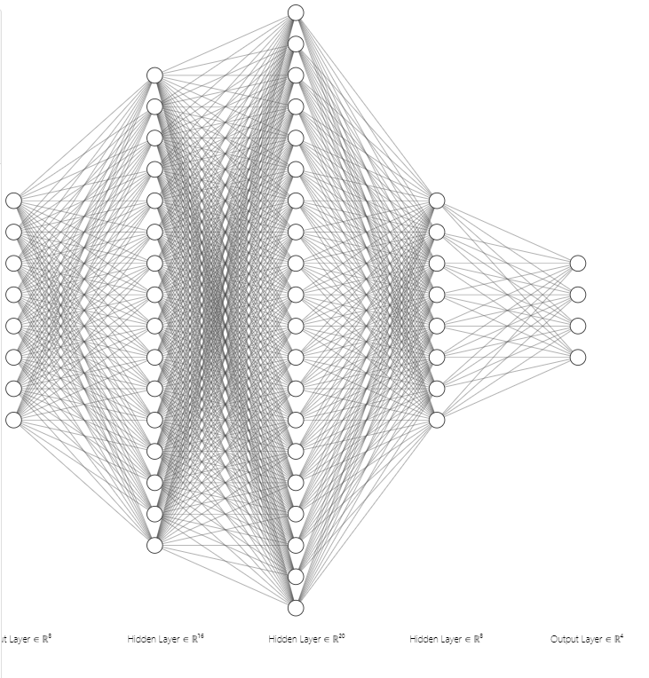
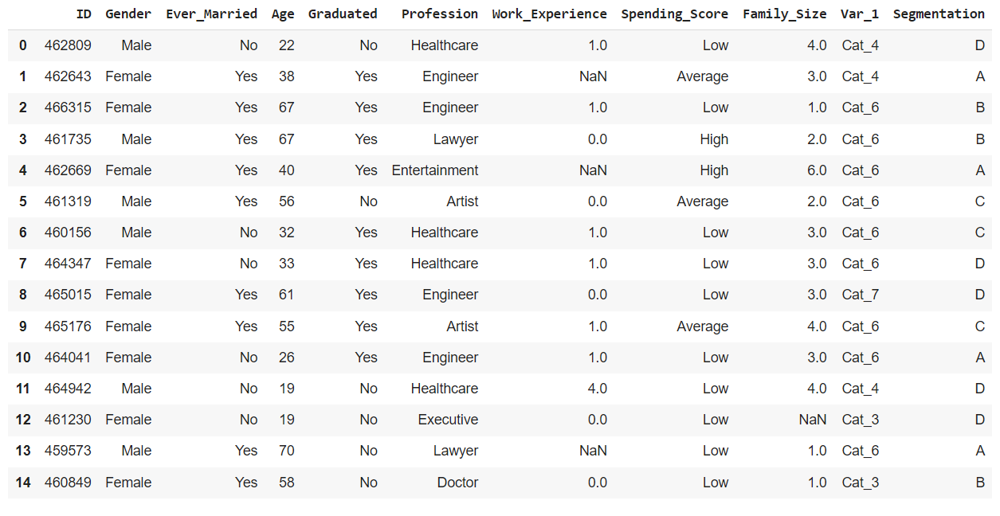
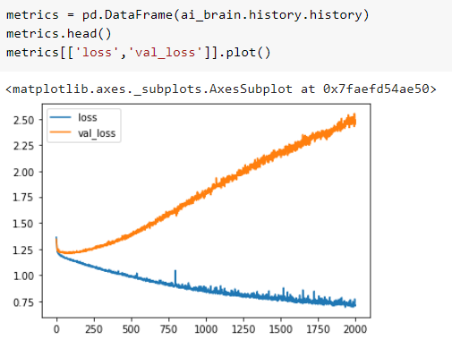
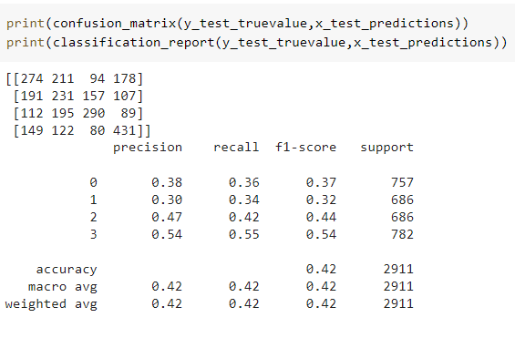
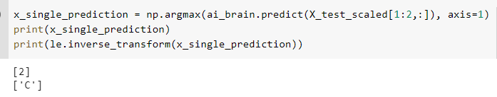

# Developing a Neural Network Classification Model

## AIM

To develop a neural network classification model for the given dataset.

## Problem Statement

An automobile company has plans to enter new markets with their existing products. After intensive market research, they’ve decided that the behavior of the new market is similar to their existing market.

In their existing market, the sales team has classified all customers into 4 segments (A, B, C, D ). Then, they performed segmented outreach and communication for a different segment of customers. This strategy has work exceptionally well for them. They plan to use the same strategy for the new markets.

You are required to help the manager to predict the right group of the new customers.

## Neural Network Model



## DESIGN STEPS

### STEP 1:
    Loading the dataset.

### STEP 2:
    Checking the null values and converting the string datatype into integer or float datatype using label encoder.


### STEP 3:
    Split the dataset into training and testing.
### STEP 4:
    Create MinMaxScaler objects,fit the model and transform the data.
### STEP 5:
    Build the Neural Network Model and compile the model.
### STEP 6:
    Train the model with the training data.
### STEP 7:
     Plot the training loss and validation loss.
### STEP 8:
    Predicting the model through classification report,confusion matrix.
### STEP 9:
    Predict the new sample data.

## PROGRAM
```python
#Developed By: Silambarasan K
#Register number: 212221230101

import pandas as pd
from sklearn.model_selection import train_test_split
from tensorflow.keras.models import Sequential
from tensorflow.keras.models import load_model
import pickle
from tensorflow.keras.layers import Dense
from tensorflow.keras.layers import Dropout
from tensorflow.keras.layers import BatchNormalization
import tensorflow as tf
import seaborn as sns
from tensorflow.keras.callbacks import EarlyStopping
from sklearn.preprocessing import MinMaxScaler
from sklearn.preprocessing import LabelEncoder
from sklearn.preprocessing import OneHotEncoder
from sklearn.preprocessing import OrdinalEncoder
from sklearn.metrics import classification_report,confusion_matrix
import numpy as np
import matplotlib.pylab as plt
df=pd.read_csv("customers.csv")
df.head(15)
df.columns
df.dtypes
df.shape
df.isnull().sum()
df_clean=df.dropna(axis=0)
df_clean.isnull().sum()
df_clean.shape
df_clean.dtypes
df_clean['Gender'].unique()
df_clean['Ever_Married'].unique()
df_clean['Graduated'].unique()
df_clean['Profession'].unique()
df_clean['Spending_Score'].unique()
df_clean['Var_1'].unique()
df_clean['Segmentation'].unique()
category_list=[
    ['Male', 'Female'],
    ['No', 'Yes'],
    ['No', 'Yes'],
    ['Healthcare', 'Engineer', 'Lawyer', 'Artist', 'Doctor',
      'Homemaker', 'Entertainment', 'Marketing', 'Executive'],
     ['Low', 'High', 'Average']
]
enc = OrdinalEncoder(categories=category_list)
df1=df_clean.copy()
df1[['Gender',
             'Ever_Married',
              'Graduated','Profession',
              'Spending_Score']] = enc.fit_transform(df1[['Gender',
                                                                 'Ever_Married',
                                                                 'Graduated','Profession',
                                                                 'Spending_Score']])
df1.dtypes
le = LabelEncoder()
df1['Segmentation'] = le.fit_transform(df1['Segmentation'])
df1.dtypes
df1 = df1.drop('ID',axis=1)
df1 = df1.drop('Var_1',axis=1)
df1.dtypes
corr = df1.corr()
sns.heatmap(corr, 
        xticklabels=corr.columns,
        yticklabels=corr.columns,
        cmap="BuPu",
        annot= True)
sns.pairplot(df1)
sns.distplot(df1['Age'])
import matplotlib.pyplot as plt
plt.figure(figsize=(10,6))
sns.countplot(df1['Family_Size'])
plt.figure(figsize=(10,6))
sns.boxplot(x='Family_Size',y='Age',data=df1)
plt.figure(figsize=(10,6))
sns.scatterplot(x='Family_Size',y='Spending_Score',data=df1)
plt.figure(figsize=(10,6))
sns.scatterplot(x='Family_Size',y='Age',data=df1)
df1.describe()
df1['Segmentation'].unique()
x=df1[['Gender','Ever_Married','Age','Graduated','Profession','Work_Experience','Spending_Score','Family_Size']].values
y1 = df1[['Segmentation']].values
one_hot_enc = OneHotEncoder()
one_hot_enc.fit(y1)
y1.shape
y = one_hot_enc.transform(y1).toarray()
y.shape
y1[0]
y[0]
x.shape
x_train,x_test,y_train,y_test=train_test_split(x,y,
                                               test_size=0.33,
                                               random_state=50)
x_train[0]  
x_train.shape
scaler_age = MinMaxScaler()
scaler_age.fit(x_train[:,2].reshape(-1, 1))
x_train_scaled = np.copy(x_train)
x_test_scaled = np.copy(x_test)
x_train_scaled.shape
# To scale the Age column
x_train_scaled[:,2] = scaler_age.transform(x_train[:,2].reshape(-1, 1)).reshape(-1)
x_test_scaled[:,2] = scaler_age.transform(x_test[:,2].reshape(-1,1)).reshape(-1)

# Creating the model

ai_brain = Sequential([
     Dense(8,input_shape=[8]),
     Dense(16,activation='relu'),
    Dense(20,activation='tanh'),
    Dense(8,activation='relu'),
       
     Dense(4,activation='softmax'),
  
])

ai_brain.compile(optimizer='adam',
                 loss='categorical_crossentropy',
                 metrics=['accuracy'])
                 
early_stop = EarlyStopping(monitor='val_loss', patience=2)  

ai_brain.fit(x_train_scaled,y_train,
             epochs=2000,batch_size=256,
             validation_data=(x_test_scaled,y_test),
             callbacks=[early_stop]
             )
             
 metrics = pd.DataFrame(ai_brain.history.history)
 metrics.head()
 metrics.plot()
 metrics[['loss','val_loss']].plot()
x_test_predictions = np.argmax(ai_brain.predict(x_test_scaled), axis=1)
x_test_predictions.shape
y_test_truevalue = np.argmax(y_test,axis=1)
y_test_truevalue.shape
print(confusion_matrix(y_test_truevalue,x_test_predictions))
print(classification_report(y_test_truevalue,x_test_predictions))

# Saving the Model
ai_brain.save('customer_classification_model.h5')

# Saving the data
with open('customer_data.pickle', 'wb') as fh:
   pickle.dump([X_train_scaled,y_train,X_test_scaled,y_test,customers_1,customer_df_cleaned,scaler_age,enc,one_hot_enc,le], fh)
   
# Loading the Model
ai_brain = load_model('customer_classification_model.h5')

# Loading the data
with open('customer_data.pickle', 'rb') as fh:
   [X_train_scaled,y_train,X_test_scaled,y_test,customers_1,customer_df_cleaned,scaler_age,enc,one_hot_enc,le]=pickle.load(fh)
   
 
x_single_prediction = np.argmax(ai_brain.predict(x_test_scaled[1:2,:]), axis=1)
print(x_single_prediction)
print(le.inverse_transform(x_single_prediction))

```


## Dataset Information



## OUTPUT

### Training Loss, Validation Loss Vs Iteration Plot

 

### Classification Report and Confusion Matrix



### New Sample Data Prediction



## RESULT
Thus,a neural network classification model for the given dataset is developed.